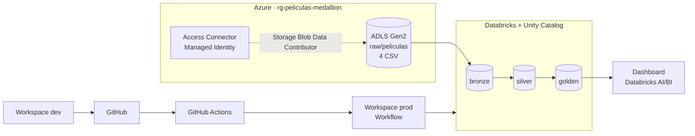
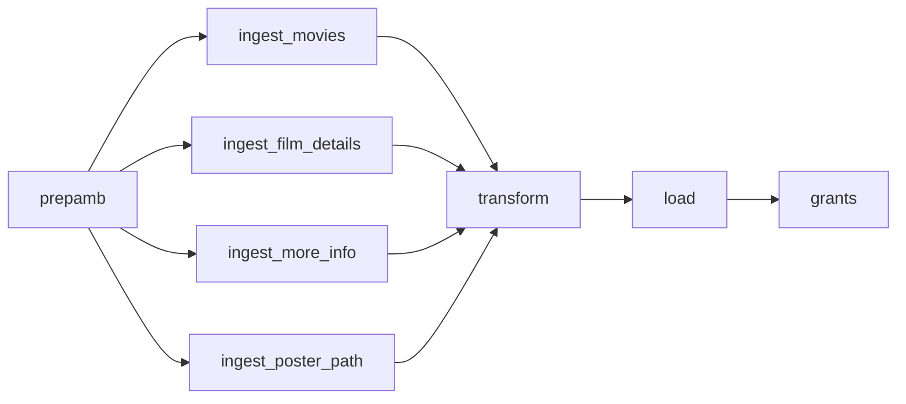
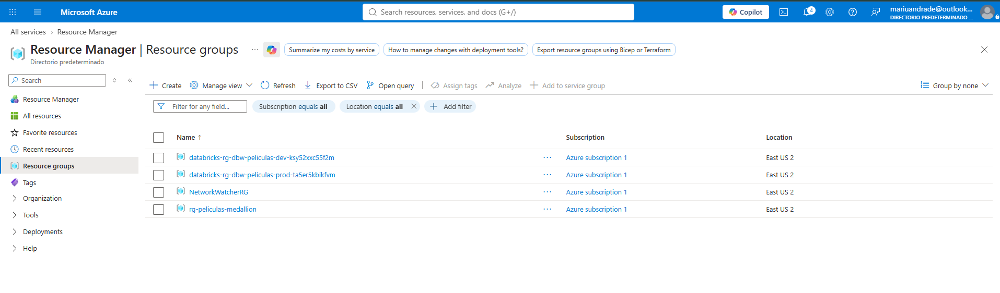
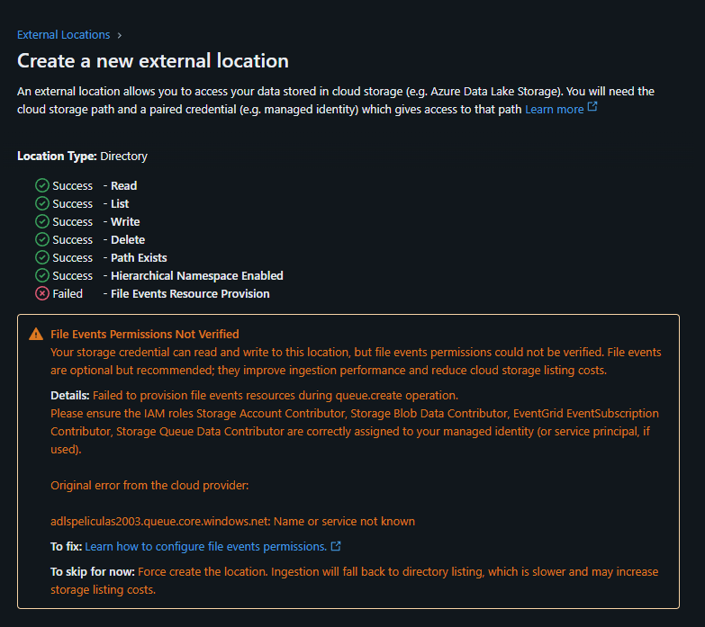
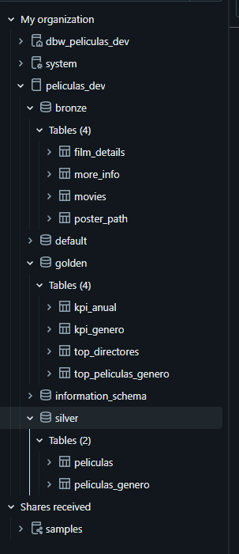
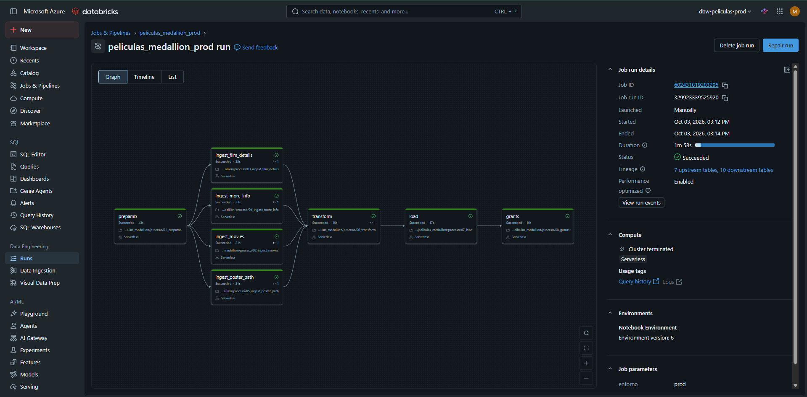
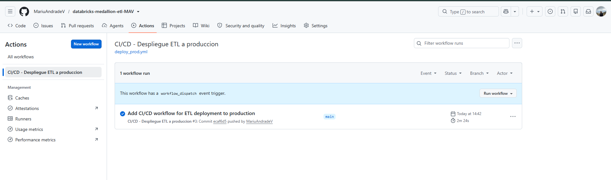
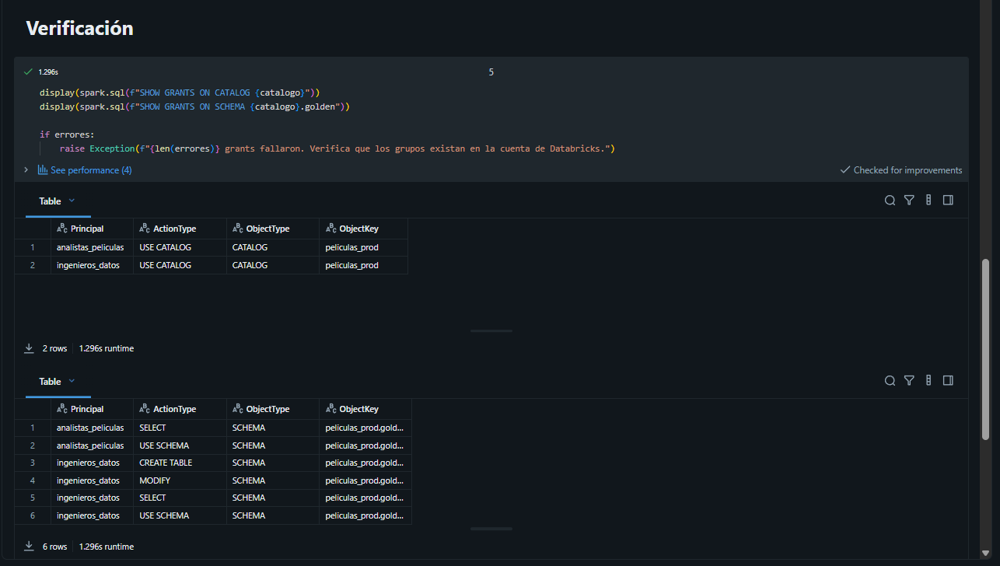

# Proyecto final · ETL medallion de películas con Azure Databricks

ETL construido en **PySpark** sobre **Azure Databricks** con arquitectura **medallion** (raw → bronze → silver → golden), gobernado con **Unity Catalog**, con acceso al Data Lake mediante **Managed Identity** y despliegue automatizado de desarrollo a producción con **GitHub Actions**.

## Arquitectura



## Servicios utilizados

| Servicio | Recurso | Uso |
|---|---|---|
| Azure Data Lake Storage Gen2 | `adlspeliculas2003` | Contenedores `raw`, `bronze`, `silver`, `golden` y `catalogo` |
| Access Connector for Azure Databricks | `ac-peliculas` | Managed Identity con rol *Storage Blob Data Contributor* sobre el storage |
| Azure Databricks (dev) | `dbw-peliculas-dev` | Desarrollo y pruebas de los notebooks |
| Azure Databricks (prod) | `dbw-peliculas-prod` | Ejecución del workflow productivo |
| Unity Catalog | `peliculas_dev`, `peliculas_prod` | Catálogo, esquemas, tablas, external locations y permisos |
| GitHub Actions | `deploy_prod.yml` | CI/CD de dev a prod |
| Databricks AI/BI Dashboard | ver carpeta `dashboard` | Visualización de la capa golden |
| Azure Cost Management | Presupuesto mensual | Control de costos con alertas |

**Restricciones del enunciado cumplidas**

- La capa raw está en ADLS Gen2, no en DBFS ni en un volumen.
- Databricks accede al Data Lake solo con Managed Identity, mediante la storage credential `sc_peliculas` y las external locations `el_*`. No se usan claves ni tokens SAS.
- El ETL usa la API de DataFrames de PySpark. SQL solo se usa para DDL (preparación de ambiente), grants y reversión.
- No hay clusters encendidos: dev y el workflow de prod usan cómputo **serverless**.

## Datasets

Fuente: [Which movie should I watch today? (Kaggle)](https://www.kaggle.com/datasets/hassanelfattmi/which-movie-should-i-watch-today). Son cuatro CSV relacionados por `id`, con 9.718 filas cada uno:

| Archivo | Contenido |
|---|---|
| `Movies.csv` | Título, géneros, idioma, puntuación, duración, fecha de estreno y votos |
| `FilmDetails.csv` | Director, reparto principal, presupuesto e ingresos en USD |
| `MoreInfo.csv` | Duración, presupuesto e ingresos en formato texto (`"$25,000,000"`, `"2h 22 min"`) |
| `PosterPath.csv` | URLs del póster y de la imagen de fondo |

## Modelo de datos

| Capa | Tabla | Descripción |
|---|---|---|
| bronze | `movies`, `film_details`, `more_info`, `poster_path` | Copia fiel de raw con esquema explícito y auditoría (`fecha_ingesta`, `archivo_origen`) |
| silver | `peliculas` | Una fila por película: limpia, tipada, deduplicada y unida (9.555 películas) |
| silver | `peliculas_genero` | Una fila por película y género |
| golden | `kpi_genero` | Películas, puntuación, votos, presupuesto, ingresos, ganancia y ranking por género |
| golden | `kpi_anual` | Evolución por año de estreno |
| golden | `top_directores` | Ranking de directores con 3 o más películas |
| golden | `top_peliculas_genero` | Top 10 por género (mínimo 1.000 votos) |

## Transformaciones aplicadas

| Problema detectado | Tratamiento en PySpark |
|---|---|
| 163 películas repetidas con distinto `id` | `Window` + `row_number()` por título, fecha y duración |
| ~30 % de presupuesto e ingresos vacíos | `coalesce` entre FilmDetails y MoreInfo; valores ≤ 0 se tratan como desconocidos |
| Montos y duración como texto | `regexp_replace`, `regexp_extract` y conversión segura compatible con modo ANSI |
| Géneros en una sola columna | `split` + `explode` |
| Enriquecimiento | Ganancia, ROI, año, década, género principal, actor principal, categorías de duración y puntuación |
| Calidad | Validación de ids nulos y repetidos, tablas vacías y consistencia de duración entre fuentes |

También se usan esquemas explícitos (`StructType`), joins con `broadcast`, agregaciones, `dense_rank`, parámetros con `dbutils.widgets` y `taskValues` entre tareas.

## Workflow



El workflow `peliculas_medallion_prod` se define en `.github/workflows/job_prod.json`. Recibe el parámetro `entorno = prod`, así que los mismos notebooks escriben en el catálogo `peliculas_prod`.

## CI/CD

El pipeline `.github/workflows/deploy_prod.yml` se ejecuta con cada push a `main` que modifique `proceso/`, o de forma manual:

1. **Validar:** compila los notebooks y valida el JSON del job.
2. **Desplegar:** con Databricks CLI, sube la carpeta `proceso` a `/Shared/peliculas_medallion/proceso` en el workspace prod.
3. **Crear o actualizar** el workflow en prod.
4. **Ejecutar** el workflow y fallar el pipeline si el resultado no es `SUCCESS`.

Las credenciales se guardan como secretos del repositorio (`DATABRICKS_HOST` y `DATABRICKS_TOKEN`), nunca en el código.

## Seguridad

| Grupo | Permisos |
|---|---|
| `ingenieros_datos` | `USE CATALOG`; `USE SCHEMA`, `SELECT`, `MODIFY` y `CREATE TABLE` en bronze, silver y golden |
| `analistas_peliculas` | `USE CATALOG`; `USE SCHEMA` y `SELECT` solo en golden |

Los grupos son de cuenta, creados desde la configuración del workspace. Los grants se aplican en `proceso/08_grants.py` (dentro del workflow) y en `seguridad/grants.sql`.

## Reversión

- `reversion/reversion.sql`: elimina tablas, esquemas y catálogo. Las external locations están comentadas porque las comparten dev y prod.
- `reversion/reversion.py`: elimina el catálogo del entorno y sus rutas físicas en ADLS. Requiere escribir `SI` en el parámetro `confirmar`.

## Estructura del repositorio

```
├── .github/workflows   # CI/CD (deploy_prod.yml) y definición del job (job_prod.json)
├── PrepAmb             # prepamb.sql: external locations, catálogo, esquemas y tablas
├── certificaciones     # certificaciones obtenidas
├── dashboard           # exportación del dashboard, capturas y enlace
├── datasets            # CSV de entrada
├── evidencias          # capturas de ejecución
├── proceso             # notebooks desplegados en prod (prepamb, ingestas, transform, load, grants)
├── reversion           # scripts para eliminar tablas lógicas y rutas físicas
├── seguridad           # grants.sql
└── README.md
```

## Cómo ejecutarlo

1. Crear los recursos de Azure (grupo de recursos, ADLS Gen2 con espacio de nombres jerárquico, Access Connector con rol *Storage Blob Data Contributor* y dos workspaces Premium).
2. Cargar los CSV de `datasets/` en `raw/peliculas/`.
3. En Databricks, crear la storage credential `sc_peliculas` con el Id. del Access Connector.
4. Crear los grupos `ingenieros_datos` y `analistas_peliculas`.
5. En dev, ejecutar los notebooks de `proceso/` en orden con `entorno = dev`.
6. Crear un token del workspace prod y guardarlo en los secretos `DATABRICKS_HOST` y `DATABRICKS_TOKEN` del repositorio.
7. Hacer push a `main`: GitHub Actions despliega y ejecuta el workflow en prod.

## Evidencias

| Evidencia | Captura |
|---|---|
| Servicios aprovisionados en Azure |  |
| Conexión con Managed Identity |  |
| Tablas en Unity Catalog |  |
| Workflow ejecutado en prod |  |
| GitHub Actions exitoso |  |
| Grants aplicados |  |

## Dashboard


El enlace al dashboard publicado está en `dashboard/enlace.txt`.
